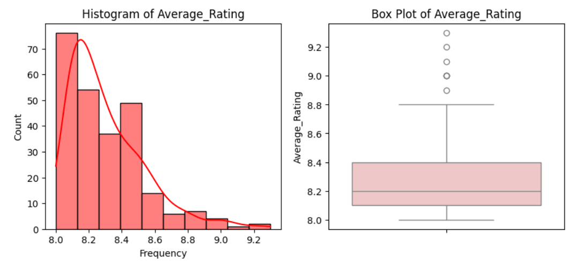
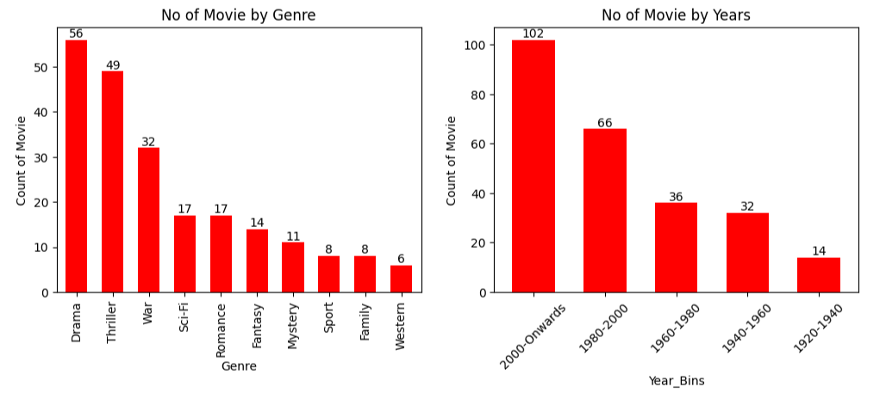
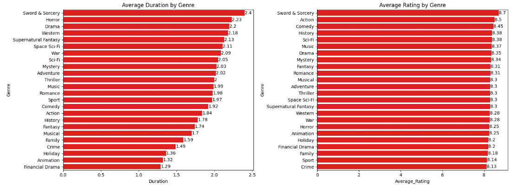
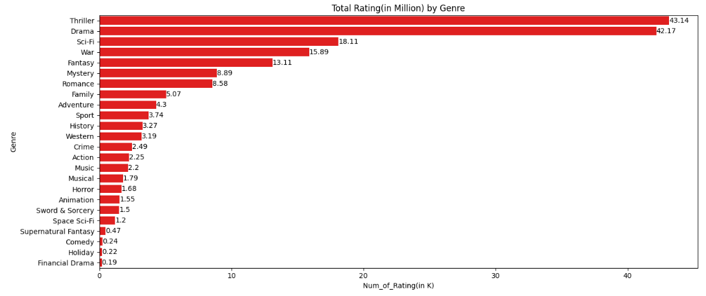
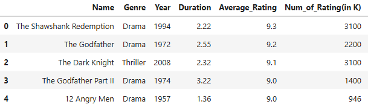
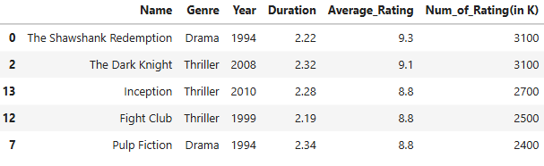
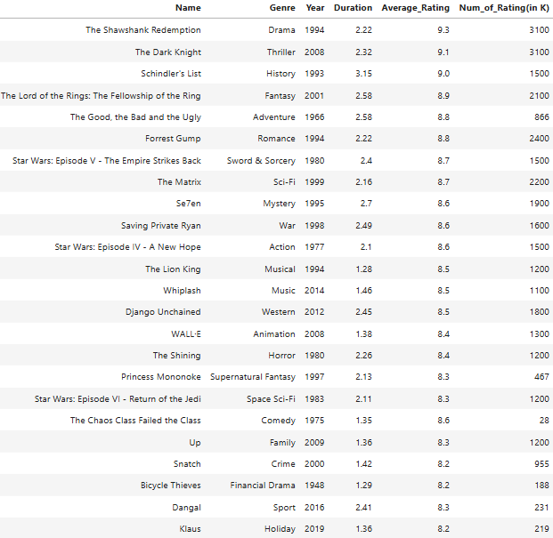

# 🎬 IMDb Top 250 — Web Scraping, Data Cleaning & EDA

## 🧠 Project by: Rohit Sharma

---

## 📌 Project Description

This project scrapes the **IMDb Top 250 Movies** and performs **data cleaning** and **exploratory data analysis (EDA)** to uncover patterns across ratings, genres, runtimes, release years, and directors.  
The scraping workflow handles **pagination** and **dynamic content** using **Beautiful Soup** and **Selenium**. Visualizations produced during EDA are available in this repository.

**Source:** [IMDb Top 250](https://www.imdb.com/chart/top/)

---

## 🎯 Problem Statement

Movie recommendation and catalog systems benefit from clean, reliable metadata. The aim of this project is to:
- **Programmatically collect** the Top 250 movie metadata from IMDb.
- **Clean and standardize** the dataset for analysis.
- **Explore** genre trends, ratings distribution, decade-wise patterns, and key contributors.
- **Surface insights** that help understand what defines a top-rated film.

---

## 📖 Table of Contents

1. [Project Overview](#project-overview)  
2. [Tech Stack](#tech-stack)  
3. [Data Understanding](#data-understanding)  
4. [Data Cleaning](#data-cleaning)  
5. [Exploratory Data Analysis (EDA)](#eda)  
6. [Insights Derived](#insights-derived)  
7. [Challenges Faced](#challenges-faced)  
8. [Future Scope](#future-scope)  
9. [Final Outcome](#final-outcome)  
10. [Project Credits](#project-credits)

---

## 🧩 Project Overview

We collected and analyzed metadata for the **Top 250 movies on IMDb**, focusing on:
- Year-wise and decade-wise release trends
- IMDb rating distribution and outliers
- Popular genres and multi-genre combinations
- Runtime distribution and its link to ratings
- Directors and countries that frequently appear in the Top 250

---

## 🛠️ Tech Stack

- **Python**: `requests`, `BeautifulSoup`, `Selenium`, `pandas`, `numpy`
- **Automation/Drivers**: Selenium WebDriver (e.g., ChromeDriver)
- **Visualization**: `matplotlib`, `seaborn`  
- **Environment**: Jupyter/Notebook or Python scripts

---

## 🧾 Data Understanding

Typical fields collected (subject to page structure):
- `title`, `year`, `rating`, `rank`
- `genre` (single or multiple)
- `duration` (runtime in minutes)
- `average_rating`
- 'total number of rating'

Raw data is saved to: `Scrapped Data/IMDB_top250.csv`  
Cleaned data is saved to: `Scrapped Data/IMDB_Top250_Cleaned.csv`

---

## 🧼 Data Cleaning

- **Column standardization**: consistent names, types, and ordering
- **Type casting**: `year` → int, `rating` → float, `duration` → int, `votes` → int
- **Parsing**: split multi-genre strings into lists; extract numeric fields
- **Duplicates & nulls**: drop duplicates, fill or drop nulls where appropriate
- **Derived columns**:
  - `decade` (e.g., 1990s, 2000s)
  - `title_clean` (stripped/pattern-cleaned title)

---

## 📊 EDA

Visualizations are available in the repository (see the **Visualizations**). Common analyses include:

### ⭐ Rating Distribution

### 🎭 Movie Distribution

### 🎬 Genre Wise Analysis
  

### 🏆 Top 5 Movies by Rating

### 🏆 Top 5 Movies by Total Ratings

### 🎯 Top Movies from Each Category

---

## 📍 Insights Derived

1. **Release Year Trends**  
   - Majority of the movies were released between 1970 and 2020.
   - A clear exponential growth in movie releases after 1970 is observed.

2. **Duration Insights**  
   - Most movies have a runtime between 1.5 to 2.5 hours.
   - Sword & Sorcery films tend to be the longest, followed by horror, drama, sci-fi, and war genres.

3. **Ratings Distribution**  
   - Average ratings for most movies lie between 8.0 and 8.4.
   - Highest-rated movies include:
     - The Shawshank Redemption (9.3)
     - The Godfather (9.2)
     - The Dark Knight (9.1)
     - The Godfather Part II (9.0)
     - 12 Angry Men (9.0)

4. **Popularity by Number of Ratings**  
   - Movies with the most audience engagement (number of votes):
     - The Shawshank Redemption (~3.1M votes)
     - The Dark Knight (~3.1M votes)
     - Inception (~2.7M votes)
     - Fight Club (~2.5M votes)
     - Pulp Fiction (~2.4M votes)

5. **Genre Analysis**  
   - Drama, Thriller, and War dominate in terms of movie count.
   - Sword & Sorcery, Action, Comedy, History, and Sci-Fi stand out with higher average ratings.

---

## ⚠️ Challenges Faced

- **Pagination & partial listing**: Initial attempts only returned the first 25 titles; addressed by identifying page/offset parameters or iterating over dynamic loads.
- **Dynamic content for genres & details**: Some attributes revealed only after interactions (e.g., expanding a panel). **Selenium** was used to render and interact with these elements.
- **Anti-bot/403 issues**: Added appropriate headers, delays, and error-handling; switched to Selenium where necessary.

---

## 🚀 Future Scope

- Build a **dashboard** (e.g., Streamlit) to explore Top 250 interactively.  
- Add **time-series refresh** to track list changes over time.  
- Enrich with **external metadata** (awards, box office, countries).  
- Train **recommendation or clustering models** using embeddings of plot/genre metadata.

---

## ✅ Final Outcome

A reliable pipeline that:
- Scrapes Top 250 metadata (handling dynamic content and pagination)  
- Produces a clean, analysis-ready dataset  
- Generates visualizations that explain trends across genres, ratings, decades, and runtimes

---

## 👏 Project Credits

- **Author:** Rohit Sharma  
- **Tech:** Beautiful Soup, Selenium, pandas, matplotlib, seaborn, requests

> Visualizations and notebooks are available in this repository. If you find this useful, consider ⭐ starring the repo!
